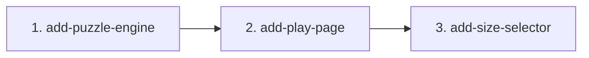

# MVP Capability Change Plan

Status: **SIGNED OFF by the user on 2026-10-04 at 18:54 (UTC+5:30); AMENDED at about 21:00 by the user's decision: slice 3 `add-size-selector` added for FR-43 (autonomy-log rows 22 and 24); amendment of 2026-10-04 about 23:30, SIGNED OFF by the user in chat at about 23:35: slice 4 `add-rules-and-reset` added for FR-57 and FR-58 (autonomy-log row 27)** (P3 plan sign-off, `docs/autonomy-log.md` row 12). AMENDED 2026-10-05 about 00:03 by the user's sign-off in chat: slice 5 `update-hint-sentences` (section 4.6) changes the hint sentences of FR-19 to FR-21 after the NFR-6 eval failed (autonomy-log row 38). The user decided not to add Playwright: G7 is reported as FAIL with the reason in 4.3. AMENDED 2026-10-05 about 23:31 by the user's signature in chat ("signed, defaults for all six", autonomy-log row 66): UX decisions 1-30 add slices A to H (section 4.8); the Playwright dependencies were approved at about 23:20 (effective after this signing, not yet installed), so the "no Playwright" decision above is superseded for slice G. **AMENDED on 2026-10-06 by the user's decision: slice `add-page-accessibility` added for NFR-9 and FR-59 to FR-65 (autonomy-log row 43; signed as FR-57 to FR-63 with A-26 and renumbered on 2026-10-08 to FR-59 to FR-65 and A-28 by the user's decision in chat, because `main` already uses FR-57, FR-58, A-26 and A-27). It was slice 4 on its own branch and is slice 6 since its merge into `main` on 2026-10-08 (section 4.7).** **Merged 2026-10-09:** the UX line and the accessibility line meet in `main`; the reconciliation change `reconcile-ux-accessibility` (section 4.9) rewrites FR-59 to FR-63 and FR-65 to the UX page model (autonomy-log rows 78 and 79). **AMENDED 2026-10-09 about 12:27 (UTC+5:30) by the user's signature in chat, «signed, use defaults» (autonomy-log row 86): the difficulty amendment adds slices DL1 `add-difficulty-engine` and DL2 `add-level-selector` (section 4.10).** **AMENDED 2026-10-10 about 00:03 (UTC+5:30) by the user's signature in chat, «signed, use defaults» (autonomy-log row 118): the phase S amendment adds three slices, `update-setup-sheet-start`, `add-theme-switch` and `add-english-version`, in that order, before G2 (section 4.11); FR-55 and FR-56 move from Future to MVP.**

Inputs: `docs/product-brief.md`, `docs/requirements.md` (signed off 16:13, amendment re-signed 18:45), and the baseline specs `openspec/specs/puzzle-engine/spec.md` and `openspec/specs/play-page/spec.md`.

## 1. Slicing principles

1. One slice per baseline capability: `puzzle-engine` → slice 1, `play-page` → slice 2.
2. Foundations first: the page consumes the engine interface pinned in the puzzle-engine spec, so slice 2 starts after slice 1 is archived.
3. Every MVP FR is owned by exactly one slice (section 5). Future rows (FR-18, FR-45 to FR-48, FR-55, FR-56) are not in this plan. (amended 2026-10-05: FR-27 is now MVP, slice F; NFR-7 moves with slice G, section 4.8) (amended 2026-10-09: FR-44 is now MVP, slice DL2, and FR-74 to FR-94 are new MVP rows owned by slices DL1 and DL2, section 4.10; difficulty amendment, autonomy-log row 86) (amended 2026-10-09: FR-95 to FR-99 are new MVP rows owned by slice DL2; setup sheet amendment, autonomy-log row 92) (amended 2026-10-10: FR-55 and FR-56 are now MVP, and FR-100 to FR-118 are new MVP rows, owned by the three phase S slices, section 4.11; the remaining Future rows are FR-18 and FR-45 to FR-48; phase S amendment, autonomy-log row 118)
4. Change folders are `openspec/changes/add-<capability>/`; every commit touching `src/` carries `Slice: <change-name>` and `Refs: FR-x`.

## 2. The capability changes

| # | Change name | Baseline spec | MVP FRs | NFRs travelled | Depends on | Parallel |
|---|---|---|---|---|---|---|
| 1 | `add-puzzle-engine` | `puzzle-engine` | FR-1 to FR-17, FR-19 to FR-26, FR-28 to FR-30, FR-49 to FR-54 (34) | NFR-1, NFR-2, NFR-3, NFR-4, NFR-5 (hint sentences), NFR-6 (eval, graded after slice 2), NFR-8 | — | serialize |
| 2 | `add-play-page` | `play-page` | FR-31 to FR-42 (12) | NFR-5 (page text) | 1 | serialize (consumes the slice 1 interface) |
| 3 | `add-size-selector` (added 21:00, user decision) | `play-page` | FR-43 (1) | NFR-5 (option labels) | 2 | serialize |
| 4 | `add-rules-and-reset` (added 23:30, user request row 27) | `play-page` | FR-57, FR-58 (2) | NFR-5 (rules text, button label) | 3 | serialize |
| 6 | `add-page-accessibility` (added 2026-10-06, user decision; slice 4 on its branch until the merge into `main` on 2026-10-08) | `play-page` | FR-59 to FR-65 (7) | NFR-9; NFR-5 (accessible names) | 3 | serialize |

**Cross-cutting rules every change honours:** TC-7 and TC-8 (engine is pure TypeScript, no DOM, no `Math.random`), TC-3 (tests in `tests/`, `*.test.ts`, `@trace` with plain IDs), TC-10 (no new dependencies without the user), test-first per slice (AGENTS.md), and "exactly one solution" is never weakened.

## 3. Dependency graph

**Critical path:** slice 1 → slice 2. **Parallelizable:** nothing. The page needs the engine interface, and the schedule is too short for a stubbed parallel start to pay off.

## 4. Per-change scope and exit criteria

### 4.1 `add-puzzle-engine` (session C, Sonnet 5.5 medium)

- **Scope in:** rule checker (FR-1 to FR-9), solver that stops at 2 (FR-10 to FR-12), seeded generator with exactly one solution and size/seed validation (FR-13 to FR-17, FR-49 to FR-51), hint engine with Ukrainian one-sentence explanations and the fixed selection order (FR-19 to FR-26), CLI with English errors (FR-28 to FR-30, FR-52 to FR-54).
- **Scope out:** N of 10 to 16 tested (FR-18), the rule-solvable guarantee (FR-27), English hint sentences (FR-56), all page behaviour.
- **Baseline spec impact:** none expected. The change's delta must stay within `puzzle-engine/spec.md`; any change to the engine interface contract is made in both specs together.
- **Definition of done:**
  1. Tests written first from the spec and seen red, including "every generated puzzle has exactly one solution" over seeds 1–20 for N = 4, 6 and 8, red against a naive generator and then green.
  2. Every MVP FR and NFR above (except NFR-6) has a test tagged `@trace <id>`; `npm run test:run`, `npm run lint`, `npm run build` and `npx openspec validate --all --strict` pass.
  3. NFR-1 to NFR-3 timing tests pass (4×4 under 200 ms, 6×6 under 500 ms, 8×8 under 3 s, worst case over the seed set).
  4. Per-slice review-gate run (correctness and spec-compliance on Opus medium, security on Sonnet medium, verifiers on Sonnet medium, focus "return only defects"), one fix round and one confirming run; no open confirmed defect.
  5. Change archived, with commits carrying `Slice: add-puzzle-engine`. **Deadline 22:00 user time** (cut line 4: otherwise slice 2 is dropped and the video shows the CLI).
- **Risks:** generator speed for 8×8 (uniqueness check on each removal); the hint precedence (broken board before rules, then pair, sandwich, count); NFR-5 strictness (no Latin letters in hint sentences); the Ukrainian number-word agreement (A-15).

### 4.2 `add-play-page` (session C, Sonnet 5.5 medium)

- **Scope in:** a 6×6 page from the generator with an injectable seed source (FR-31), distinct and locked givens (FR-32, FR-33), click cycle (FR-34), rule highlighting recomputed after every change (FR-35 to FR-38), hint button that fills one cell and shows the sentence (FR-39, FR-40), win message (FR-41), new-puzzle button (FR-42), Ukrainian page text (NFR-5).
- **Scope out:** size selector (FR-43; restored after slice 2 as slice 3, section 4.4), bilingual page (FR-55), difficulty, timer, saved progress, undo, daily puzzle (FR-44 to FR-48), real-browser tests (NFR-7), keyboard and screen-reader support (A-20).
- **Baseline spec impact:** none expected.
- **Definition of done:**
  1. jsdom tests written first from the spec and seen red; every FR above and NFR-5 (page part) has a test tagged `@trace <id>`.
  2. `npm run test:run`, `npm run lint`, `npm run build` and `npx openspec validate --all --strict` pass; `npm run dev` serves the page.
  3. Per-slice review-gate as in 4.1. If the 5-hour meter is above 70% before this review-gate, the confirming run is skipped (brief rule).
  4. Change archived with `Slice: add-play-page` commits, before the 00:00 freeze.
- **Risks:** the page must not restate engine rules (it reads the rule checker and hint results); the hint index mapping (engine 0-based, DOM 1-based); jsdom cannot catch rendering defects (TC-13).

### 4.4 `add-size-selector` (added 2026-10-04 about 21:00 by the user's decision, autonomy-log row 22)

- **Scope in:** a size selector `[data-control="size"]` with the options 4, 6 and 8 labelled «Поле 4×4», «Поле 6×6», «Поле 8×8», 6×6 at start; choosing a size starts a new puzzle of that size from a new seed and clears the hint and win messages; a value outside 4, 6, 8 is ignored; the page board, highlighting, hint and win use the chosen size; the new-puzzle button keeps the chosen size (FR-43).
- **Scope out:** sizes 10 to 16 (FR-18), remembering the choice (TC-12), keyboard and screen-reader support (A-20).
- **Baseline spec impact:** `play-page/spec.md` is amended together with the change (delta MODIFIED and ADDED requirements, plus the non-requirement text: Purpose, ownership, DOM contract, the "FR-43 is cut" section, Exclusions). A few slice-2 tests that assert "always 6×6" are changed deliberately to the amended spec and listed in the test commit.
- **Definition of done:** tests first and seen red; lint, test:run, build and strict validation pass; per-slice review-gate (one fix round, one confirming run); archived with `Slice: add-size-selector` commits before the 00:00 freeze.

### 4.5 `add-rules-and-reset` (signed about 23:35, added 2026-10-04 about 23:30 by the user's request, autonomy-log row 27)

- **Scope in:** a rules block `[data-section="rules"]` below the board with the heading «Правила» and three fixed list items (FR-57); a «Скинути» button `[data-action="reset"]` that empties every non-given cell and clears messages and highlights, for every offered size 4, 6 and 8 (FR-58).
- **Scope out:** undo (FR-47), saved progress (FR-46), restarting with a new puzzle (that is FR-42), keyboard and screen-reader support (A-20).
- **Baseline spec impact:** `play-page/spec.md` gets two ADDED requirements; Purpose, the ownership line ("FR-31 to FR-43, FR-57, FR-58") and the DOM contract lines for `[data-section="rules"]` and `[data-action="reset"]` are edited at archive.
- **Definition of done:** tests first and seen red; lint, test:run, build and strict validation pass; per-slice review-gate (one fix round, one confirming run); real-browser check at 375 px; archived with `Slice: add-rules-and-reset` commits before the moved freeze of about 00:45.

### 4.6 `update-hint-sentences` (signed in chat about 00:03 on 2026-10-05, autonomy-log row 38)

- **Why:** the NFR-6 eval failed (count 76 < 80); the judges said the sentences give the conclusion without the rule, and the plural «решта клітинок» is wrong when one cell is empty.
- **Scope in:** the hint sentence templates in `src/engine/hint.ts` and the `puzzle-engine` spec scenarios that pin them, matching the amended FR-19 to FR-21 (each sentence says why; the count rule has a singular form for one empty cell). Tests that pin sentences are updated first and seen red.
- **Scope out:** hint selection order, hint targets, FR-25, FR-26 and the page; no new FRs (FR-19 to FR-21 stay owned by slice 1).
- **Definition of done:** tests first and seen red; lint, test:run, build and strict validation pass; per-slice review-gate; `eval-suite` re-run; the eval ratchet baseline is minted only if every case scores at least 80, otherwise NFR-6 stays FAIL.

### 4.8 UX amendment, slices A to H (signed in chat about 23:31 on 2026-10-05, autonomy-log row 66; UX decisions 1-30)

Source: `docs/design/ux-decisions.md`; frozen reference `design/README.md` and `design/v0-screenshots/review-set-5/` (decision 30). Rows that need a real browser or a vision pass are held in `docs/requirements-held.md` (NOT-EARNED, never PASS) until the slice below moves them. Slice names are working names; the OpenSpec change names are fixed when each change is created.

- **Order:** A, then B, then C, with D and E alongside; F any time (independent of the page); G and H after. Every slice: tests first and seen red, a dedicated agent on Sonnet, per-slice review-gate (one fix round, one confirming run), archive with `Slice: <change-name>` and `Refs: FR-x` on commits touching `src/`. Each slice amends `openspec/specs/play-page/spec.md` (or `puzzle-engine/spec.md` for F) together with the change, lists the deliberately changed tests in the test commit, and runs `npx openspec validate --all --strict` before the next slice.
- **Slice A, layout** (decisions 1, 2, 9, 12). IDs: FR-57 (amended), FR-68, FR-71, NFR-5, A-26. Scope in: header with the «Правила» button and the rules popover, document order, the always-present message area with the idle line. Scope out: the visual placement checks (held NFR-10, NFR-14).
- **Slice B, hinted cell** (decision 3). IDs: FR-66, FR-39 (amended). Scope in: the `cell-hinted` marker and its removal rules. Scope out: perception of the non-colour cue (held NFR-11).
- **Slice C, dialog, segmented control, accessible cells** (decisions 4, 6, 8). IDs: FR-67, FR-42 (amended), FR-43 (amended), FR-58 (amended), FR-73, FR-69, FR-70, NFR-5, A-20, A-24. Scope in: the confirmation dialog, the three-button radiogroup (Tab reaches every button, Enter or Space selects, arrow keys not required, A-24), cells as buttons with Ukrainian labels. The select-based size tests change deliberately (list in the test commit). Scope out: focus and accessibility checks in a browser (held NFR-13).
- **Slice D, win apostrophe** (decision 14). IDs: FR-41 (amended). A one-line change with its test constant.
- **Slice E, logo** (decision 10). IDs: FR-72, TC-14. Scope in: the inline SVG logo with no text. Scope out: legibility at 40 px (held NFR-15).
- **Slice F, rule-solvable generator** (decision 7). IDs: FR-27, A-5, A-31. Independent of the UI; engine only, no DOM. FR-15, FR-14 and NFR-1 to NFR-3 must hold; if they cannot, the slice stops and an amendment is raised, nothing is relaxed silently (A-31).
- **Slice G, Playwright tooling** (after the dependencies are installed with the user's approval already given, TC-10). Scope in: `check:visual` with `quality/visual-parity.config.json`, the accessibility check script and the browser tests, each shown runnable and seen failing against today's page first. Then a further signed step moves NFR-7, NFR-10, NFR-12, NFR-13, TC-13 and A-14 from `docs/requirements-held.md` into `docs/requirements.md`, and NFR-14 last, only after `check:visual` is seen failing.
- **Page texts (user decision 2026-10-05 about 23:40, autonomy-log row 67):** slice A creates `src/ui/strings.ts` and moves every Ukrainian page text there; slices B to E add their texts there and inline none elsewhere in `src/ui/` or `src/main.ts`. Hint sentences stay in the engine. Languages (FR-55, FR-56) stay Future; decide on a language switch before slice G pins the pixel reference.
- **Slice H, vision check** (user answer to Q3). Scope in: a `check:vision` script as its own small tooling slice (no package), seen failing first. Then a further signed step moves NFR-11 and NFR-15 into `docs/requirements.md`.
- **Definition of done for A to F:** tests first and seen red; lint, test:run, build and strict validation pass; per-slice review-gate; archived. For G and H: the script exists, exits non-zero today with instructions, and is seen failing before any held row moves; no stub that exits 0.
- **Risks:** jsdom has no layout and no popover behaviour and may lack `showModal` (tests assert attributes and spy on the call); NFR-3 pressure from FR-27 (slice F); the held rows stay NOT-EARNED until G and H are done.

### 4.3 After both slices (session C)

- Eval (NFR-6, optional, cut line 2): `eval-suite` with `eval-judge` on 2–3 Ukrainian hint cases, each scoring at least 80 out of 100.
- `npm run gate:status`, `npm run retro:digest`, handoff.
- **Gates that will not pass tonight, by design, and are reported as such:** G7 runs `traceability --release --strict-recordings`, which needs a recording manifest for every MVP FR and accepts no waiver; no recordings are built (Playwright is not installed, NFR-7 is Future), so **G7 will report FAIL**. Recordings and visual checks stay NOT-EARNED. G5 (coverage) is attempted, not promised.

### 4.7 `add-page-accessibility` (slice 6; added 2026-10-06 by the user's decision, autonomy-log row 43; slice 4 on its branch until the merge into `main` on 2026-10-08)

- **Scope in:** the play page follows `docs/frontend-conventions.md` and fixes gaps G1–G6 and G9 of its §9, as FR-59 to FR-65 and NFR-9 require:
  - the board as a WAI-ARIA grid with one Tab stop and arrow, Home/End and Ctrl+Home/End keys;
  - Enter or Space cycles a cell;
  - Ukrainian accessible names, `aria-readonly` on givens and `aria-invalid` on violations;
  - a visible «Розмір поля» label;
  - `role="status"` messages;
  - a heavier violation border;
  - at least 3:1 contrast for borders, cues and focus;
  - `:focus-visible` rings, an explicit select text colour, and `touch-action: manipulation`.
- **Scope out:** 44 px phone targets (G7), confirm or Undo before discarding progress and state in the URL (G8), real-browser and screen-reader tests (TC-13, NFR-7), and axe (`scripts/check-a11y.mjs` needs Playwright).
- **Baseline spec impact:** `play-page/spec.md` is amended together with the change:
  - ADDED requirements for FR-59 to FR-65 and NFR-9;
  - MODIFIED requirements wherever the DOM contract or existing scenarios change;
  - the non-requirement text: the DOM contract, ownership, and the Exclusions line that cites A-20, which is superseded.
- **Definition of done:**
  - tests first and seen red;
  - lint, test:run, build and strict validation pass;
  - a keyboard check in the built-in browser (TC-13 smoke);
  - a per-slice review with clean evidence in `review-findings.json`;
  - archived with `Slice: add-page-accessibility` commits.

### 4.9 `reconcile-ux-accessibility` (added 2026-10-09 by the user's decisions, autonomy-log rows 77 to 79; archived 2026-10-09, row 80)

Runs on `claude/reconcile-ux-main` after the merge of the UX line into `main` (`603b631`) and before phases D to H, which then run on `main`. Owns the rewritten text of FR-59 to FR-63 and FR-65 and NFR-9 (the ids stay owned by slice 6, section 4.7; no new FR). Steps as for every slice: change folder by the spec-writer with an independent audit, tests first (each changed test derives from a changed requirement, spec sentence or rule, listed in its `tasks.md`), implementation, review-gate, a real-browser check at 375 and 1280 px, archive.

### 4.10 Difficulty amendment, slices DL1 and DL2 (signed 2026-10-09, autonomy-log row 86)

Source: `docs/handoff/difficulty-amendment-draft-2026-10-09.md` (signed with all defaults), `docs/requirements.md` (FR-44, FR-74 to FR-94, NFR-16, NFR-17, A-33 to A-39). The measurement `docs/qa/difficulty-measurement/README.md` is a scratch prototype, not acceptance evidence. (This section is numbered 4.10 because 4.9 is `reconcile-ux-accessibility`.)

- **Order:** DL1 before G1 (the browser checks of phase G then cover the level control). DL2 after the user updates the frozen design reference (Q3: level control, description line, techniques section); DL1 does not wait for the design. DL2 depends on DL1. Every slice: tests first and seen red, a dedicated agent on Sonnet, per-slice review-gate (one fix round, one confirming run), `npx openspec validate --all --strict` before the next slice, archive with `Slice: <change-name>` and `Refs: FR-x` on commits touching `src/`. Each slice amends its spec (`puzzle-engine/spec.md` for DL1, `play-page/spec.md` for DL2) together with the change.
- **Slice DL1, `add-difficulty-engine`.** Owns: FR-74 to FR-86 (FR-74 to FR-77 techniques, FR-78 to FR-80 hint sentences, FR-81 to FR-84 level and generator, FR-85 and FR-86 CLI). NFRs travelled: NFR-16, NFR-17; NFR-1 to NFR-5 extended. Amended rows it implements without owning a new copy: FR-13, FR-14, FR-15, FR-22, FR-27 (owner slice F), FR-30 unchanged.
  - **Scope in:** the line-balance, unique-lines and look-ahead techniques in the hint engine with the order of FR-77; the level parameter and exact-level generator (levels 1 to 4 for N = 6 and 8, level 1 only for N = 4); bounded attempts (**`MAX_ATTEMPTS` 100**, amended FR-84 and A-35; the change folder's spec, design and tests that pin 30 change deliberately, evidence `docs/qa/add-difficulty-engine/spike.txt`) and the distinct run-out error; CLI `--level`; the three new Ukrainian hint sentences (provisional draft wording, the user confirms the final strings in the page slice, Q6, and the pinned strings then change deliberately); measured numbers per (N, level) in `docs/qa/`.
  - **Scope out:** all page behaviour (DL2); changing FR-25 (unchanged, Q6); N = 4 above level 1.
  - **Starts with:** (1) the level 1 golden file (every (N, seed) of the fixed set, taken before any change, so level 1 output stays byte-identical, FR-14, FR-85); (2) the timing spike for a fast level-4 check (Q5), target at most 50% of NFR-2 and NFR-3 per (N, level).
  - **Stop condition (A-36):** if level 4 cannot hold NFR-2 and NFR-3 with that margin, or the 100 attempts (limit raised from 30, autonomy-log rows 91 and 92) run out on the fixed seed set (A-35), the slice stops and raises an amendment; no bound is relaxed silently, no level test is loosened, "exactly one solution" is never weakened.
  - **Definition of done:** tests first and seen red: one case per technique (positive and near-miss), the 5-step contradiction not found (cap 4), determinism and order, exact level (solvable with techniques 1..L, not with 1..L−1), uniqueness and the same solution across levels, 0 run-outs, golden file for level 1, CLI cases; every owned FR and NFR-16 and NFR-17 have a test tagged `@trace`; lint, test:run, build and strict validation pass; the measured numbers and the 50% check are reported in `docs/qa/`; per-slice review-gate; archived.
- **Slice DL2, `add-level-selector`.** Owns: FR-44, FR-87 to FR-94 and, from the setup sheet amendment (autonomy-log row 92), **FR-95 to FR-99** (summary button, setup sheet, choosing and closing, sheet and confirmation, level option content). NFRs travelled: NFR-4, NFR-5, NFR-9 extended to the new texts, the summary button, the sheet and the level radiogroup. Amended rows it implements without owning a new copy: FR-42 (slice 2), FR-43 (slice 1), FR-57 (slice 4), FR-58 (slice 4), FR-59, FR-62, FR-65, FR-66, FR-67 (slice C), FR-68 (slice A), FR-73 (slice C), and FR-88's page retry (FR-88 is owned here; it uses the run-out error of FR-84, owned by DL1).
  - **Scope in:** the summary button `[data-action="setup"]` and the setup sheet holding the size and level radiogroups (structure A at every form factor; the level options show name and description, no persistent description line), the sheet's close, focus return and confirmation order (FR-97, FR-98), the 4×4 behaviour (levels 2 to 4 `aria-disabled` with the reason inside the sheet and a non-colour cue, Q1), the page retry on a run-out (at most 3 seeds, only the run-out error, FR-88, A-38; the "one seed per press" tests hold for first-seed success), size and level interplay, confirmation on a level change, the second section of the rules panel, all new text in `src/ui/strings.ts`, the final Ukrainian strings confirmed by the user in chat (Q6), the page hint using all four techniques (Q2).
  - **Scope out:** the held rows NFR-10, NFR-12, NFR-13, NFR-14 (they stay held and NOT-EARNED; G1 and G2 must cover the level control, the design reference update is the user's step, Q3); remembering the level (TC-12).
  - **Starts after:** DL1 archived (with the attempt limit 100) and the designer's visual design of structure A, with the user naming the reference set in chat (Q3, rows 90 and 92; `review-set-6` is intermediate). The change folder `openspec/changes/add-level-selector` is reworked for the sheet first (delta spec, design, tasks, proposal; the test-change list of the draft's section 5, the page retry scenarios).
  - **Definition of done:** jsdom tests and stylesheet tests (focus and contrast of the new buttons) written first and seen red; every owned FR has a test tagged `@trace`; lint, test:run, build and strict validation pass; `src/ui/strings.ts` holds all new text; per-slice review-gate; a real-browser smoke at 375 and 1280 px; archived. Follow-ups in the slices' own changes: `docs/product-brief.md`, `openspec/specs/puzzle-engine/spec.md`, `openspec/specs/play-page/spec.md`.

### 4.11 Phase S amendment: «Почати», theme switch, English version (signed 2026-10-10 about 00:03, autonomy-log row 118)

Source: `docs/handoff/setup-sheet-start-amendment-draft-2026-10-09.md` (SD) and `docs/handoff/theme-language-amendment-draft-2026-10-09.md` (TD), signed together with all defaults; `docs/requirements.md` (FR-55, FR-56, FR-100 to FR-118, A-45 to A-55); NFR-18 held in `docs/requirements-held.md`. User decisions: autonomy-log rows 114 (select, then «Почати»), 116 (theme, English, one amendment, three slices, G2 after all three), 117 (harness lines, one `testMatch` pattern) and 119 (overnight authorisations). Slice names are the drafts' proposals; the OpenSpec change names are fixed when each change is created.

- **Order:** `update-setup-sheet-start`, then `add-theme-switch`, then `add-english-version`, then G2 (NFR-14), so the pixel reference moves once. All three run after `fix-action-button-targets`. The spec-writer writes the three change folders together (proposal, design, tasks, delta specs citing FR-55, FR-56 and FR-100 to FR-118), and the composed rows go into `docs/requirements.md` with them; the later folders write their MODIFIED blocks against the earlier folders' result, checked by archiving the three in order in a scratch copy (row 69 precedent). Each folder gets an independent audit. One design round for the whole amendment (designer, design-reviewer, at most two iterations per signed wireframe; the user signs the wireframe D1 and moves the pixel reference); each slice waits for the design parts it uses. Design-dependent text (FR-68 placement of the controls, the «Почати» look and token in FR-65, the sheet footer in FR-96) stays a placeholder in the folder and is completed after the signed wireframe (TD-Q15), logged. Every slice: tests first and seen red, per-slice review-gate (one fix round, one confirming run), `npm run test:e2e`, `npm run check:a11y`, the full battery (lint, tests, build, `npx openspec validate --all --strict`, `node scripts/check-eval-ratchet.mjs`), a browser check, archive with `Slice: <change-name>` and `Refs: FR-x` on commits touching `src/`, `docs/current-state.md` with evidence pointers.
- **Slice S1, `update-setup-sheet-start`** (SD). Owns: **FR-100** (marked choice) and **FR-101** («Почати»). Amended rows it implements without owning a new copy: FR-43 (slice 3), FR-44, FR-87, FR-88, FR-90 to FR-92, FR-94 to FR-99 (DL2), FR-59, FR-65 (slice 6), FR-66, FR-67, FR-73 (slices B, C); NFRs travelled: NFR-5, NFR-9, NFR-12, NFR-13 (the «Почати» parts).
  - **Scope in:** size and level presses only mark (`aria-checked` = the marked choice while the sheet is open); one «Почати» makes one puzzle with both, with one seed (retry only after a run-out) and one confirmation when the board has entries; Закрити, Escape and light dismiss discard the marked choice; a cancelled confirmation drops the pending action; 4×4 marked sets «Розминка»; focus to the summary button; the «Почати» label in `src/ui/strings.ts`; the test-change list of SD section 6.
  - **Scope out:** the theme and language controls; the desktop rules-panel size (design only, SD-Q9); storing anything (game state is never stored).
- **Slice S2, `add-theme-switch`** (TD section 8 step 4). Owns: **FR-102 to FR-106** (theme control, at-once press, effective theme, auto follows the system, theme-color) and **FR-113 to FR-118** (stored preferences, fallback, failing storage, the head step before the first paint, common control rules, not part of the marked choice); the storage module and the head step are built here for both keys, and the language half of FR-116 is completed in S3. Amended rows it implements: FR-65 (dark token block, contrast per token set), FR-59, FR-66, TC-12, A-48, A-50, A-51; NFRs travelled: NFR-9 and NFR-13 (theme states), NFR-12 (theme options). Also: NFR-18's e2e spec and its `testMatch` pattern (row 117), seen failing, then NFR-18 moves from held into `docs/requirements.md` (TD section 5 item 16).
  - **Scope out:** the full design palette (G2, A-51); English texts (S3).
- **Slice S3, `add-english-version`** (TD section 8 step 5). Owns: **FR-55** and **FR-56** (Future to MVP, pointer rows) and **FR-107 to FR-112** (language control, re-render in place, document language and title, hint re-render, English page text, English hint sentences); the per-language half of FR-113 to FR-116. Amended rows it implements: FR-19 to FR-22, FR-25, FR-26, FR-40, FR-41, FR-43, FR-57, FR-61, FR-62, FR-67, FR-70, FR-71, FR-78 to FR-80, FR-87, FR-89, FR-91, FR-93 to FR-97, FR-101 (English label); NFRs travelled: NFR-4, NFR-5 (per mode), NFR-6 (new eval dimension `hint-clarity-en`), NFR-9 (WCAG 3.1.1, 3.1.2), NFR-10, NFR-12, NFR-13 (English states). The English strings follow the TD appendix (TD-Q2; row 119), confirmed before red tests pin them; the engine's Ukrainian output stays byte-identical. Then the eval run for `hint-clarity-en` (TD-Q9).
  - **Scope out:** an English pixel reference (TD-Q10: the pixel gate uses Ukrainian shots only); any change to the CLI (NFR-8).
- **Risks:** the extra 44 px «Почати» may bring back inner scroll in the sheet (SD section 7); English labels at 320 px (escalation: a 1 px-step width sweep from 320 to 400 px in English, before G2); the engine contract change for the hint re-render (TD-Q8, puzzle-engine spec l. 13); persisted preferences leak between tests and captures (clear storage per test and per shot); NFR-18 stays NOT-EARNED until its spec is seen failing and moved.

## 5. FR coverage check

| FR | Slice | FR | Slice | FR | Slice |
|---|---|---|---|---|---|
| FR-1 | 1 | FR-17 | 1 | FR-35 | 2 |
| FR-2 | 1 | FR-19 | 1 | FR-36 | 2 |
| FR-3 | 1 | FR-20 | 1 | FR-37 | 2 |
| FR-4 | 1 | FR-21 | 1 | FR-38 | 2 |
| FR-5 | 1 | FR-22 | 1 | FR-39 | 2 |
| FR-6 | 1 | FR-23 | 1 | FR-40 | 2 |
| FR-7 | 1 | FR-24 | 1 | FR-41 | 2 |
| FR-8 | 1 | FR-25 | 1 | FR-42 | 2 |
| FR-9 | 1 | FR-26 | 1 | FR-49 | 1 |
| FR-10 | 1 | FR-28 | 1 | FR-50 | 1 |
| FR-11 | 1 | FR-29 | 1 | FR-51 | 1 |
| FR-12 | 1 | FR-30 | 1 | FR-52 | 1 |
| FR-13 | 1 | FR-31 | 2 | FR-53 | 1 |
| FR-14 | 1 | FR-32 | 2 | FR-54 | 1 |
| FR-15 | 1 | FR-33 | 2 | | |
| FR-16 | 1 | FR-34 | 2 | FR-43 | 3 |
| FR-57 | 4 | FR-58 | 4 | | |
| FR-59 | 6 | FR-62 | 6 | FR-65 | 6 |
| FR-60 | 6 | FR-63 | 6 | | |
| FR-61 | 6 | FR-64 | 6 | | |

FR-19 to FR-21 stay owned by slice 1; slice 5 changes their wording and adds no FRs.

Added 2026-10-05 (UX amendment, section 4.8; the new and newly MVP IDs, each owned exactly once):

| FR | Slice | FR | Slice | FR | Slice |
|---|---|---|---|---|---|
| FR-27 | F | FR-68 | A | FR-71 | A |
| FR-66 | B | FR-69 | C | FR-72 | E |
| FR-67 | C | FR-70 | C | FR-73 | C |

FR-39, FR-41, FR-42, FR-43, FR-57 and FR-58 keep the owner in the table above (slices 2, 3, 4); slices A to E change them as amended rows and own no new copy of them.

Added 2026-10-09 (difficulty amendment, section 4.10; the new and newly MVP IDs, each owned exactly once):

| FR | Slice | FR | Slice | FR | Slice |
|---|---|---|---|---|---|
| FR-74 | DL1 | FR-81 | DL1 | FR-87 | DL2 |
| FR-75 | DL1 | FR-82 | DL1 | FR-88 | DL2 |
| FR-76 | DL1 | FR-83 | DL1 | FR-89 | DL2 |
| FR-77 | DL1 | FR-84 | DL1 | FR-90 | DL2 |
| FR-78 | DL1 | FR-85 | DL1 | FR-91 | DL2 |
| FR-79 | DL1 | FR-86 | DL1 | FR-92 | DL2 |
| FR-80 | DL1 | FR-44 | DL2 | FR-93 | DL2 |
| | | | | FR-94 | DL2 |

Added 2026-10-09 (setup sheet amendment, autonomy-log row 92):

| FR | Slice | FR | Slice | FR | Slice |
|---|---|---|---|---|---|
| FR-95 | DL2 | FR-97 | DL2 | FR-99 | DL2 |
| FR-96 | DL2 | FR-98 | DL2 | | |

FR-13, FR-14, FR-15, FR-22, FR-27, FR-42, FR-43, FR-57, FR-58, FR-59, FR-62, FR-65, FR-66, FR-67, FR-68 and FR-73 keep the owner in the tables above; DL1 and DL2 change them as amended rows and own no new copy of them (FR-84 and FR-88 are amended in place and keep their DL1 and DL2 owners). FR-25, FR-26, FR-30, FR-92 and FR-93 are unchanged. DL1 owns 13 new FRs (FR-74 to FR-86), DL2 owns 14 (FR-44, FR-87 to FR-99): 27 in all.

Added 2026-10-10 (phase S amendment, section 4.11, autonomy-log row 118; the new and newly MVP IDs, each owned exactly once):

| FR | Slice | FR | Slice | FR | Slice |
|---|---|---|---|---|---|
| FR-100 | S1 | FR-106 | S2 | FR-112 | S3 |
| FR-101 | S1 | FR-107 | S3 | FR-113 | S2 |
| FR-102 | S2 | FR-108 | S3 | FR-114 | S2 |
| FR-103 | S2 | FR-109 | S3 | FR-115 | S2 |
| FR-104 | S2 | FR-110 | S3 | FR-116 | S2 |
| FR-105 | S2 | FR-111 | S3 | FR-117 | S2 |
| FR-55 | S3 | FR-56 | S3 | FR-118 | S2 |

S1 is `update-setup-sheet-start` (2 FRs), S2 `add-theme-switch` (11 FRs), S3 `add-english-version` (8 FRs, FR-55 and FR-56 included): 21 in all. Every other amended row of the phase S amendment keeps its owner in the tables above; S1 to S3 change it as an amended row and own no new copy of it.

Total: **56 MVP FRs across 5 slices that own FRs** (34 in slice 1, 12 in slice 2, 1 in slice 3, 2 in slice 4, 7 in slice 6; slice 5 adds none; no gaps, no duplicates), plus **9 MVP FRs across slices A, B, C, E, F** from the 2026-10-05 amendment (FR-27, FR-66 to FR-73), 65 in all, plus **27 MVP FRs across slices DL1 and DL2** from the 2026-10-09 difficulty and setup sheet amendments (22 plus FR-95 to FR-99), 92 in all, plus **21 MVP FRs across slices S1, S2 and S3** from the 2026-10-10 phase S amendment (FR-55, FR-56, FR-100 to FR-118), **113 in all**. Slice D owns no new FR (it amends FR-41); slices G and H own no FR.

## 6. Sequencing and schedule

Re-baselined 2026-10-04 18:40 (autonomy-log row 10; user time, UTC+5:30):

| Step | Ends about | Session |
|---|---|---|
| P3 plan sign-off | 19:25 | B (Opus 5.5 medium) |
| Slice 1 `add-puzzle-engine`, archived | 21:25 (hard limit 22:00, cut line 4) | C (Sonnet 5.5 medium) |
| Slice 2 `add-play-page`, archived | 23:25 | C |
| Stretch, only if slice 2 is archived before about 23:00: restore the size selector (FR-43) as a small follow-up change; the user decides at that point. The spec text is at tag `step-08-p2-draft` (labels «Поле 4×4», «Поле 6×6», «Поле 8×8», A-24); restoring it is a requirements amendment, a spec section, tests and code, about 30 minutes | before 00:00 | C |
| Slice 4 `add-rules-and-reset`, archived (signed about 23:35, added 23:30, autonomy-log row 27) | 00:40 | C |
| Slice 5 `update-hint-sentences`, archived, eval re-run (signed in chat about 00:03 on 2026-10-05, autonomy-log row 38) | 00:40 | C |
| Feature freeze | about 00:45 (moved by the user at 23:28 from 00:00, which was 21:30 Kyiv) | — |
| Eval (optional), gate status, retro, PR text, README branch | after the slices; PR open by 02:29 (23:59 Kyiv) | C or D |

Cut lines still in force, in order, whenever the work is more than 30 minutes behind this table: (1) skip the global review-gate, (2) drop the eval, (3) shrink slice 2 to grid, highlighting, win message and new puzzle, (4) drop slice 2 if slice 1 is not archived by 22:00. Each cut is logged in `docs/autonomy-log.md` and `docs/budget.md` and reported to the user. After each archive, run `npx openspec validate --all --strict` before starting the next slice. Future-phase work is not in this plan.
