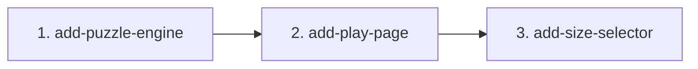

# MVP Capability Change Plan

Status: **SIGNED OFF by the user on 2026-10-04 at 18:54 (UTC+5:30); AMENDED at about 21:00 by the user's decision: slice 3 `add-size-selector` added for FR-43 (autonomy-log rows 22 and 24)** (P3 plan sign-off, `docs/autonomy-log.md` row 12). The user decided not to add Playwright: G7 is reported as FAIL with the reason in 4.3.

Inputs: `docs/product-brief.md`, `docs/requirements.md` (signed off 16:13, amendment re-signed 18:45), and the baseline specs `openspec/specs/puzzle-engine/spec.md` and `openspec/specs/play-page/spec.md`.

## 1. Slicing principles

1. One slice per baseline capability: `puzzle-engine` → slice 1, `play-page` → slice 2.
2. Foundations first: the page consumes the engine interface pinned in the puzzle-engine spec, so slice 2 starts after slice 1 is archived.
3. Every MVP FR is owned by exactly one slice (section 5). Future rows (FR-18, FR-27, FR-44 to FR-48, FR-55, FR-56, NFR-7) are not in this plan.
4. Change folders are `openspec/changes/add-<capability>/`; every commit touching `src/` carries `Slice: <change-name>` and `Refs: FR-x`.

## 2. The capability changes

| # | Change name | Baseline spec | MVP FRs | NFRs travelled | Depends on | Parallel |
|---|---|---|---|---|---|---|
| 1 | `add-puzzle-engine` | `puzzle-engine` | FR-1 to FR-17, FR-19 to FR-26, FR-28 to FR-30, FR-49 to FR-54 (34) | NFR-1, NFR-2, NFR-3, NFR-4, NFR-5 (hint sentences), NFR-6 (eval, graded after slice 2), NFR-8 | — | serialize |
| 2 | `add-play-page` | `play-page` | FR-31 to FR-42 (12) | NFR-5 (page text) | 1 | serialize (consumes the slice 1 interface) |
| 3 | `add-size-selector` (added 21:00, user decision) | `play-page` | FR-43 (1) | NFR-5 (option labels) | 2 | serialize |

**Cross-cutting rules every change honours:** TC-7 and TC-8 (engine is pure TypeScript, no DOM, no `Math.random`), TC-3 (tests in `tests/`, `*.test.ts`, `@trace` with plain IDs), TC-10 (no new dependencies without the user), test-first per slice (AGENTS.md), and "exactly one solution" is never weakened.

## 3. Dependency graph

**Critical path:** slice 1 → slice 2. **Parallelizable:** nothing. The page needs the engine interface, and the schedule is too short for a stubbed parallel start to pay off.

## 4. Per-change scope and exit criteria

### 4.1 `add-puzzle-engine` (session C, Sonnet 5.5 medium)

- **Scope in:** rule checker (FR-1 to FR-9), solver that stops at 2 (FR-10 to FR-12), seeded generator with exactly one solution and size/seed validation (FR-13 to FR-17, FR-49 to FR-51), hint engine with Ukrainian one-sentence explanations and the fixed selection order (FR-19 to FR-26), CLI with English errors (FR-28 to FR-30, FR-52 to FR-54).
- **Scope out:** N of 10 to 16 tested (FR-18), the rule-solvable guarantee (FR-27), English hint sentences (FR-56), all page behaviour.
- **Baseline spec impact:** none expected. The change's delta must stay within `puzzle-engine/spec.md`; any change to the engine interface contract is made in both specs together.
- **Definition of done:**
  1. Tests written first from the spec and seen red, including "every generated puzzle has exactly one solution" over seeds 1–20 for N = 4, 6 and 8, red against a naive generator and then green.
  2. Every MVP FR and NFR above (except NFR-6) has a test tagged `@trace <id>`; `npm run test:run`, `npm run lint`, `npm run build` and `npx openspec validate --all --strict` pass.
  3. NFR-1 to NFR-3 timing tests pass (4×4 under 200 ms, 6×6 under 500 ms, 8×8 under 3 s, worst case over the seed set).
  4. Per-slice review-gate run (correctness and spec-compliance on Opus medium, security on Sonnet medium, verifiers on Sonnet medium, focus "return only defects"), one fix round and one confirming run; no open confirmed defect.
  5. Change archived, with commits carrying `Slice: add-puzzle-engine`. **Deadline 22:00 user time** (cut line 4: otherwise slice 2 is dropped and the video shows the CLI).
- **Risks:** generator speed for 8×8 (uniqueness check on each removal); the hint precedence (broken board before rules, then pair, sandwich, count); NFR-5 strictness (no Latin letters in hint sentences); the Ukrainian number-word agreement (A-15).

### 4.2 `add-play-page` (session C, Sonnet 5.5 medium)

- **Scope in:** a 6×6 page from the generator with an injectable seed source (FR-31), distinct and locked givens (FR-32, FR-33), click cycle (FR-34), rule highlighting recomputed after every change (FR-35 to FR-38), hint button that fills one cell and shows the sentence (FR-39, FR-40), win message (FR-41), new-puzzle button (FR-42), Ukrainian page text (NFR-5).
- **Scope out:** size selector (FR-43; restored after slice 2 as slice 3, section 4.4), bilingual page (FR-55), difficulty, timer, saved progress, undo, daily puzzle (FR-44 to FR-48), real-browser tests (NFR-7), keyboard and screen-reader support (A-20).
- **Baseline spec impact:** none expected.
- **Definition of done:**
  1. jsdom tests written first from the spec and seen red; every FR above and NFR-5 (page part) has a test tagged `@trace <id>`.
  2. `npm run test:run`, `npm run lint`, `npm run build` and `npx openspec validate --all --strict` pass; `npm run dev` serves the page.
  3. Per-slice review-gate as in 4.1. If the 5-hour meter is above 70% before this review-gate, the confirming run is skipped (brief rule).
  4. Change archived with `Slice: add-play-page` commits, before the 00:00 freeze.
- **Risks:** the page must not restate engine rules (it reads the rule checker and hint results); the hint index mapping (engine 0-based, DOM 1-based); jsdom cannot catch rendering defects (TC-13).

### 4.4 `add-size-selector` (added 2026-10-04 about 21:00 by the user's decision, autonomy-log row 22)

- **Scope in:** a size selector `[data-control="size"]` with the options 4, 6 and 8 labelled «Поле 4×4», «Поле 6×6», «Поле 8×8», 6×6 at start; choosing a size starts a new puzzle of that size from a new seed and clears the hint and win messages; a value outside 4, 6, 8 is ignored; the page board, highlighting, hint and win use the chosen size; the new-puzzle button keeps the chosen size (FR-43).
- **Scope out:** sizes 10 to 16 (FR-18), remembering the choice (TC-12), keyboard and screen-reader support (A-20).
- **Baseline spec impact:** `play-page/spec.md` is amended together with the change (delta MODIFIED and ADDED requirements, plus the non-requirement text: Purpose, ownership, DOM contract, the "FR-43 is cut" section, Exclusions). A few slice-2 tests that assert "always 6×6" are changed deliberately to the amended spec and listed in the test commit.
- **Definition of done:** tests first and seen red; lint, test:run, build and strict validation pass; per-slice review-gate (one fix round, one confirming run); archived with `Slice: add-size-selector` commits before the 00:00 freeze.

### 4.3 After both slices (session C)

- Eval (NFR-6, optional, cut line 2): `eval-suite` with `eval-judge` on 2–3 Ukrainian hint cases, each scoring at least 80 out of 100.
- `npm run gate:status`, `npm run retro:digest`, handoff.
- **Gates that will not pass tonight, by design, and are reported as such:** G7 runs `traceability --release --strict-recordings`, which needs a recording manifest for every MVP FR and accepts no waiver; no recordings are built (Playwright is not installed, NFR-7 is Future), so **G7 will report FAIL**. Recordings and visual checks stay NOT-EARNED. G5 (coverage) is attempted, not promised.

## 5. FR coverage check

| FR | Slice | FR | Slice | FR | Slice |
|---|---|---|---|---|---|
| FR-1 | 1 | FR-17 | 1 | FR-35 | 2 |
| FR-2 | 1 | FR-19 | 1 | FR-36 | 2 |
| FR-3 | 1 | FR-20 | 1 | FR-37 | 2 |
| FR-4 | 1 | FR-21 | 1 | FR-38 | 2 |
| FR-5 | 1 | FR-22 | 1 | FR-39 | 2 |
| FR-6 | 1 | FR-23 | 1 | FR-40 | 2 |
| FR-7 | 1 | FR-24 | 1 | FR-41 | 2 |
| FR-8 | 1 | FR-25 | 1 | FR-42 | 2 |
| FR-9 | 1 | FR-26 | 1 | FR-49 | 1 |
| FR-10 | 1 | FR-28 | 1 | FR-50 | 1 |
| FR-11 | 1 | FR-29 | 1 | FR-51 | 1 |
| FR-12 | 1 | FR-30 | 1 | FR-52 | 1 |
| FR-13 | 1 | FR-31 | 2 | FR-53 | 1 |
| FR-14 | 1 | FR-32 | 2 | FR-54 | 1 |
| FR-15 | 1 | FR-33 | 2 | | |
| FR-16 | 1 | FR-34 | 2 | FR-43 | 3 |

Total: **47 MVP FRs across 3 slices** (34 in slice 1, 12 in slice 2, 1 in slice 3; no gaps, no duplicates).

## 6. Sequencing and schedule

Re-baselined 2026-10-04 18:40 (autonomy-log row 10; user time, UTC+5:30):

| Step | Ends about | Session |
|---|---|---|
| P3 plan sign-off | 19:25 | B (Opus 5.5 medium) |
| Slice 1 `add-puzzle-engine`, archived | 21:25 (hard limit 22:00, cut line 4) | C (Sonnet 5.5 medium) |
| Slice 2 `add-play-page`, archived | 23:25 | C |
| Stretch, only if slice 2 is archived before about 23:00: restore the size selector (FR-43) as a small follow-up change; the user decides at that point. The spec text is at tag `step-08-p2-draft` (labels «Поле 4×4», «Поле 6×6», «Поле 8×8», A-24); restoring it is a requirements amendment, a spec section, tests and code, about 30 minutes | before 00:00 | C |
| Feature freeze | 00:00 (21:30 Kyiv) | — |
| Eval (optional), gate status, retro, PR text, README branch | after the slices; PR open by 02:29 (23:59 Kyiv) | C or D |

Cut lines still in force, in order, whenever the work is more than 30 minutes behind this table: (1) skip the global review-gate, (2) drop the eval, (3) shrink slice 2 to grid, highlighting, win message and new puzzle, (4) drop slice 2 if slice 1 is not archived by 22:00. Each cut is logged in `docs/autonomy-log.md` and `docs/budget.md` and reported to the user. After each archive, run `npx openspec validate --all --strict` before starting the next slice. Future-phase work is not in this plan.
